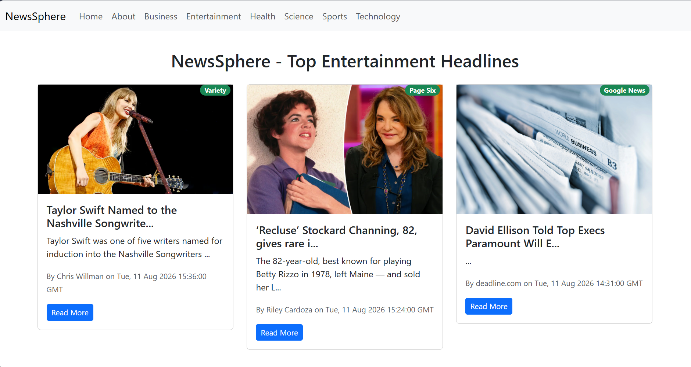
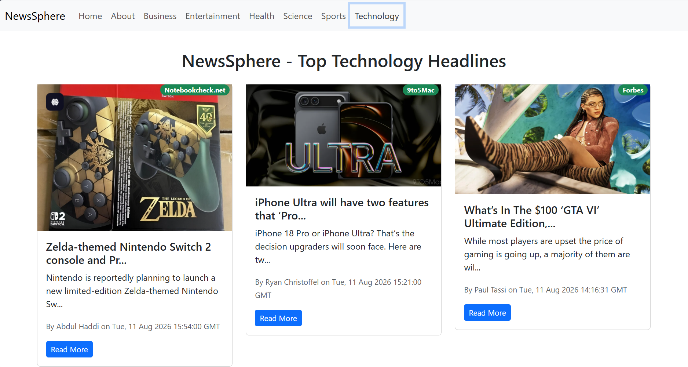
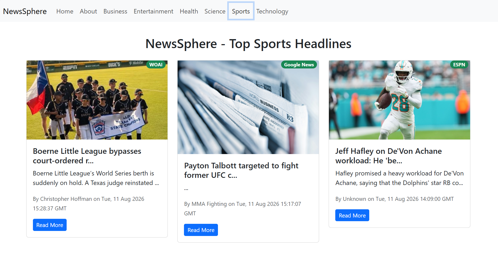

# 📰 NewsSphere


NewsSphere is a modern React-based news application that provides users with the latest headlines from different categories including Business, Entertainment, Health, Science, Sports, and Technology. The application fetches real-time news using NewsAPI and offers a smooth browsing experience with infinite scrolling and dynamic loading indicators.

---

# 🚀 Features

* 📰 Latest top headlines from NewsAPI
* 📂 Category-wise news browsing
* ♾️ Infinite scrolling for seamless content loading
* ⚡ Top loading progress bar
* 🔄 Real-time news updates
* 📱 Fully responsive design
* 🏷️ News source badges
* 👤 Author and publication date information
* 🔗 Direct link to full news articles
* 🛣️ React Router based navigation

---

# 🛠️ Tech Stack

* React.js
* JavaScript (ES6+)
* React Router DOM
* Bootstrap 5
* NewsAPI
* React Infinite Scroll Component
* React Top Loading Bar

---

# 📸 Screenshots

Add your project screenshots here.

## Home Page



## Technology News



## Sports News



---

# 📂 Project Structure

```bash
src/
│
├── components/
│   ├── Navbar.js
│   ├── News.js
│   ├── NewsItem.js
│   └── Spinner.js
│
├── App.js
├── App.css
└── index.js
```

---

# ⚙️ Installation

Clone the repository:

```bash
git clone https://github.com/kaish10-hub/NewsSphere.git
```

Move to the project directory:

```bash
cd NewsSphere
```

Install dependencies:

```bash
npm install
```

Create a `.env.local` file in the root directory:

```env
REACT_APP_NEWS_API=YOUR_NEWS_API_KEY
```

Start the development server:

```bash
npm start
```

The application will run at:

```bash
http://localhost:3000
```

---

# 🔑 Getting NewsAPI Key

1. Visit NewsAPI.
2. Create a free account.
3. Generate your API key.
4. Add the key inside `.env.local`.

Example:

```env
REACT_APP_NEWS_API=xxxxxxxxxxxxxxxxxxxxxxxx
```

---

# 🌟 Available Categories

* General
* Business
* Entertainment
* Health
* Science
* Sports
* Technology

---

# 📈 Future Improvements

* Dark Mode
* Search Functionality
* Country Selection
* Bookmark Articles
* User Authentication
* Trending News Section

---

# 🤝 Contributing

Contributions are welcome.

1. Fork the repository
2. Create a new branch
3. Make your changes
4. Commit your changes
5. Open a Pull Request

---

# 👨‍💻 Author

**Mohd Kaish**

* GitHub: https://github.com/kaish10-hub

---

# ⭐ Support

If you found this project useful, consider giving it a **Star ⭐** on GitHub.
